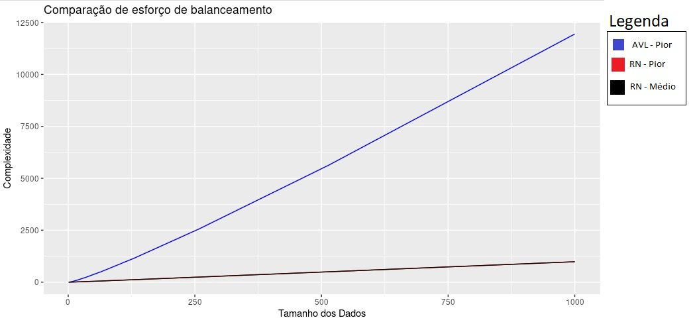

# Análise de Complexidade de Árvores Binárias Auto Balanceadas: AVL e Rubro-negra  
  
Este projeto tem como objetivo analisar a complexidade algorítmica das operações de adição de chaves (valores) e as respectivas operações de balanceamento nas seguintes árvores binárias auto balanceadas: árvore AVL e árvore Rubro-negra, considerando o pior caso para AVL e o caso médio e pior caso para Rubro-negra.  
  
  
  
## Índice  
  
- [Introdução](#introdução)  
- [Árvore AVL](#árvore-avl)  
- [Árvore Rubro-negra](#árvore-rubro-negra)  
- [Análise de Complexidade](#análise-de-complexidade)  
- [Conclusão](#conclusão)  
  
## Introdução  
  
Árvores binárias auto balanceadas são estruturas de dados que garantem que a altura da árvore permaneça balanceada após cada operação de inserção ou remoção. Isso é importante para garantir que as operações de busca, inserção e remoção sejam eficientes e ocorram em tempo logarítmico.  
  
Neste projeto, analisamos duas árvores binárias auto balanceadas populares: árvore AVL e árvore Rubro-negra, levando em consideração o pior caso para a árvore AVL e o caso médio e pior caso para a árvore Rubro-negra.  
  
## Árvore AVL  
  
A árvore AVL (Adelson-Velsky e Landis) é uma árvore binária auto balanceada que foi inventada por dois cientistas da computação soviéticos, Georgy Adelson-Velsky e Evgenii Landis, em 1962. Uma árvore AVL é uma árvore binária de busca balanceada em que a diferença de altura entre a subárvore esquerda e a subárvore direita de qualquer nó é no máximo 1. Nesta análise, consideramos o pior caso para a árvore AVL.  
  
## Árvore Rubro-negra  
  
A árvore Rubro-negra é outra árvore binária auto balanceada, que foi introduzida por Rudolf Bayer em 1972 e aperfeiçoada por Chris Okasaki em 1999. A árvore Rubro-negra é uma árvore binária de busca em que cada nó possui uma cor (rubro ou negro) e satisfaz as seguintes propriedades:  
  
1. Todo nó é rubro ou negro.  
2. A raiz da árvore é sempre negra.  
3. Todos os nós folha são negros (nós nulos).  
4. Se um nó é rubro, então ambos os seus filhos são negros.  
5. Para cada nó, todos os caminhos de um nó até os nós folha descendentes contêm o mesmo número de nós negros.  
  
Nesta análise, consideramos o caso médio e pior caso para a árvore Rubro-negra.  
  
## Análise de Complexidade  
  
Neste projeto, comparamos a complexidade algorítmica das operações de adição de chaves e as respectivas operações de balanceamento para árvores AVL e Rubro-negra, levando em conta o pior caso para a árvore AVL e o caso médioe pior caso para a árvore Rubro-negra. A análise de complexidade é realizada usando gráficos que demonstram o tempo de execução dessas operações em função do tamanho das árvores.

## Conclusão

Através da análise dos gráficos e dos dados coletados, é possível determinar qual árvore binária auto balanceada possui melhor desempenho em termos de tempo de execução para as operações de adição de chaves e balanceamento, considerando o pior caso para a árvore AVL e o caso médio e pior caso para a árvore Rubro-negra. Essa informação é útil para decidir qual estrutura de dados é mais adequada para uma aplicação específica.
